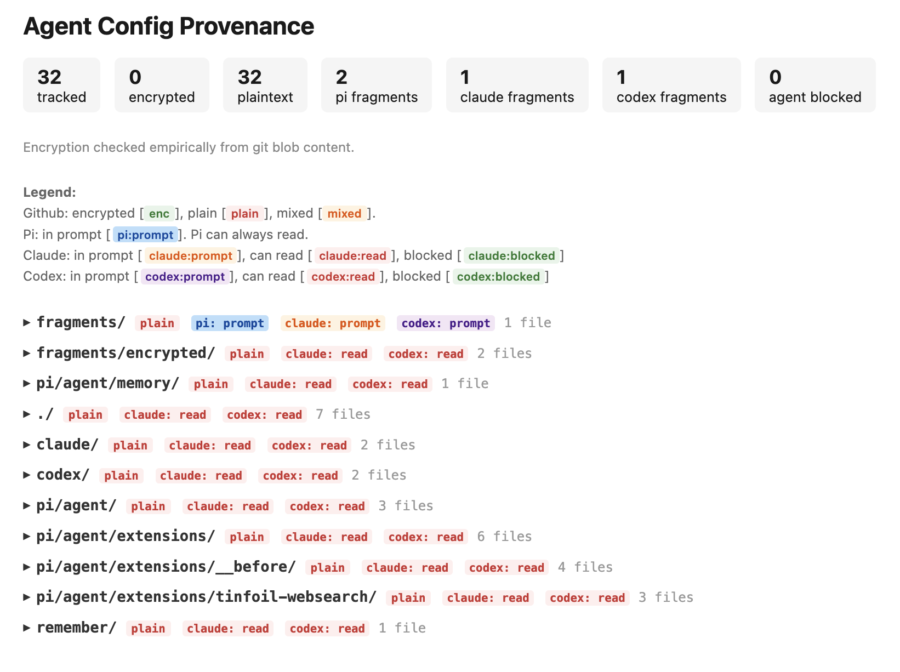

Example agent config. Companion to [blog here]().

Disclaimer: This is pretty vibe-coded, and only graded on 'does this seem to do what I want'. It also assumes a Mac. Use at your own risk :).

## How it works

One git repo at `~/agents/` holds the config for three agents — Pi, Claude, Codex. Each agent's configuration dir should be set as a symlink into this repo:

```
~/.pi     → ~/agents/pi
~/.claude → ~/agents/claude
~/.codex  → ~/agents/codex
```

Shared instruction fragments live in `fragments/`. Each agent's index file (`CLAUDE.md` / `AGENTS.md`) pulls in the fragments it should see via `@import`:

```markdown
## Preferences

@~/agents/fragments/shared-preferences.md
```

Claude and Codex share `shared-preferences.md`. Pi gets that plus `fragments/encrypted/` (git-crypt encrypted, Claude/Codex can't read). The `@~/agents/...` paths resolve to `$HOME/agents/...`, so the repo must live at `~/agents/`.

Git-crypt encrypts the private stuff so the repo can be backed up on GitHub without leaking anything. Filenames are not encrypted.

To prevent unwanted agents from reading paths we use sandboxing. This is setup with the [information-guard](https://github.com/danielmccannsayles/information-guard). By default it also constrains some common dangerous writes. If you're switching to this from eg. the default claude code sandbox, it shouldn't weaken the protection much, but it's worth making sure. The information-guard does not touch network access, unlike Claudes sandbox, so this is a change.

## Directory structure

```
~/agents/
├── claude/
│   ├── CLAUDE.md              # Claude's system prompt (index, @imports fragments)
│   ├── settings.json          # SessionStart hook: sets AGENT_FLAG=claude
│   └── memory/                # Claude's memories (git-crypt encrypted)
├── codex/
│   ├── AGENTS.md              # Codex's system prompt
│   └── config.toml            # Model + native sandbox deny rules
├── pi/
│   └── agent/
│       ├── AGENTS.md          # Pi's system prompt (index, @imports fragments)
│       ├── models.json        # Provider config ($TINFOIL_API_KEY)
│       ├── extensions/        # Pi extensions
│       │   ├── __before/      # Load-order bundle, necessary for correct system reminders
│       │   ├── git-guard.ts   # Tags bash commands with AGENT_FLAG=pi
│       │   └── ...
│       ├── memory/            # Pi's memories (git-crypt encrypted)
│       └── .gitignore
├── fragments/
│   ├── shared-preferences.md  # Shared across all agents (plaintext)
│   └── encrypted/             # Pi-only (git-crypt encrypted)
├── remember/                  # Things to save (git-crypt encrypted)
├── visualize-provenance.mjs   # Visualize what's encrypted / what each agent sees
└── compile-prompt.mjs         # Assemble & view an agent's full prompt
```

## Prerequisites

- [pi](https://github.com/earendil-works/pi)
- [Claude Code](https://docs.anthropic.com/en/docs/claude-code)
- [Codex](https://github.com/openai/codex) (or omit)
- [git-crypt](https://github.com/AGWA/git-crypt)
- Node (for the two scripts)
- [information-guard](https://github.com/danielmccannsayles/information-guard) (sandboxing + git guard)
- [vscode-hatch](https://github.com/danielmccannsayles/vscode-hatch) (VS Code extension — required by pi's vscode-hatch extension for VS Code awareness/tools; install locally per its README)

## Setup

1. **Clone to `~/agents/`** (the `@~/agents/...` import paths require this location):

   ```bash
   git clone <this-repo> ~/agents
   ```

2. **Symlink the agent config dirs:**

   ```bash
   ln -s ~/agents/pi ~/.pi
   ln -s ~/agents/claude ~/.claude
   ln -s ~/agents/codex ~/.codex
   ```

   (Codex can share Claude's prompt: `ln -sf ../claude/CLAUDE.md ~/.codex/AGENTS.md` — the `-f` replaces the repo's `codex/AGENTS.md`)

3. **Set up git-crypt** (encrypts memories, private fragments, pi extensions on GitHub):

   ```bash
   cd ~/agents
   git-crypt init
   git-crypt export-key ~/agents/git-crypt-key  # store somewhere safe
   ```

   Then uncomment the rules in `.gitattributes`.

4. **If using Tinfoil** :

Set your key.

```bash
export TINFOIL_API_KEY="your-key-here"  # in ~/.zshrc
```

To make sure that your requests are verfiable private, use the [Tinfoil Proxy](https://docs.tinfoil.sh/local-proxy/app). It runs locally on `127.0.0.1:3301` and handles attestation. Point pi at it via `baseUrl` in `pi/agent/models.json`.

5. **Install the [information-guard](https://github.com/danielmccannsayles/information-guard)** — follow its README. For this setup specifically:
   - `~/agents` in `~/.config/information-guard/repos.txt` (git guard)
   - the private paths in `~/.config/information-guard/sandbox.json`:

     ```json
     {
       "protectedPaths": [
         "~/agents/pi/agent/memory",
         "~/agents/fragments/encrypted",
         "~/agents/pi/agent/extensions",
         "~/agents/remember"
       ],
       "writeContainment": { "enabled": true, "allowWrite": [] }
     }
     ```

   - aliases in `~/.zshrc`:

     ```bash
     alias claude='information-guard-sandbox claude' # claude needs sandbox, agent flag is in hooks
     alias codex='AGENT_FLAG=codex codex' # codex has its own sandbox (apple sandboxes don't nest), but needs the agent flag
     ```

   - codex gets the same protection from its native sandbox: `information-guard-sandbox --print-codex-config` generates the profile from your sandbox.json — paste it into `~/.codex/config.toml` (this repo's `codex/config.toml` shows the result).

6. **Uncomment `.gitattributes`** so git-crypt starts encrypting.

7. **Test it:**

   ```bash
   node visualize-provenance.mjs   # visual on data provenance
   node compile-prompt.mjs pi # creates prompt.md
   ```

   **Make sure it does NOT look like this:**

   

   Spin up your agents, have them try to read things they shouldn't. Push to GitHub and verify the encrypted paths are ciphertext (filenames are not encrypted).

8. **Optional extensions**

If using the websearch extension, make sure to install deps, these aren't auto-installed by Pi.

```bash
cd ~/agents/pi/agent/extensions/tinfoil-websearch && npm install
```
